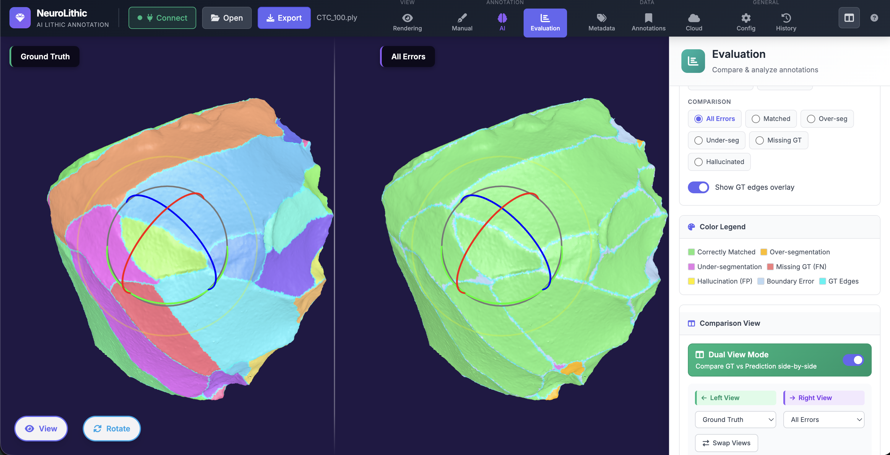

# lithicmesh

## 3D mesh annotation tool for lithic artifacts

The web page is deployed [here](https://lithicmesh-4742db0b77d1.herokuapp.com/).

## TODO list

- [x] Support exported files with annotations
- [ ] Automated edge identification algorithms
- [ ] Segmentation: algorithm and visualization mode
- [x] Annotation with arrows
- [x] [Bounding Volume Hierarchy](https://github.com/gkjohnson/three-mesh-bvh) for drawing on large objects