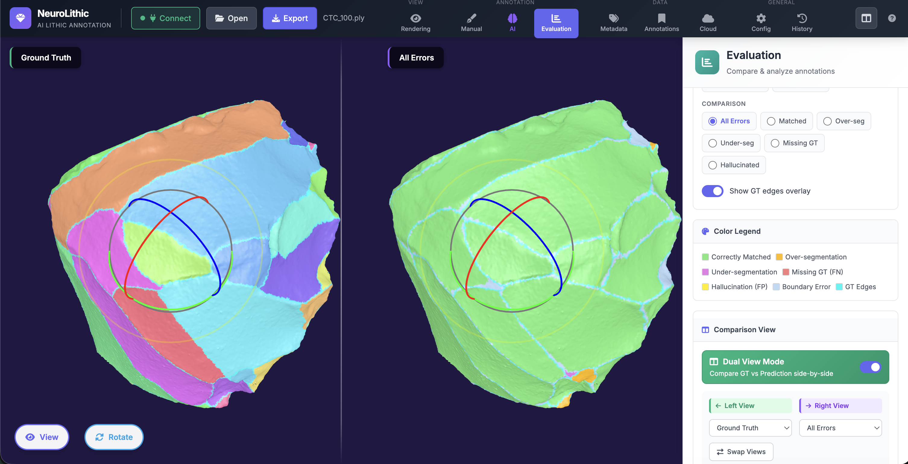

# neurolithic-web

## 3D mesh annotation tool for lithic artifacts

The web page is deployed at [neurolithic.org](https://neurolithic.org/).



## Features

### Mesh Loading & Export
- **PLY** format with full round-trip support for annotations and custom metadata (ASCII and binary)
- **MAT** (MATLAB) format for legacy compatibility
- Demo mesh auto-loads for quick exploration

### Drawing & Annotation Tools
- **Draw** — freehand edge annotation with shortest-path connectivity
- **Erase** — remove annotations with a configurable brush
- **Ridge** — follow sharp surface features using edge-angle-weighted pathfinding
- **Line** — connect vertices with straight lines
- **Arrow** — add directional annotations
- Full undo/redo history

### Segmentation
- Union-Find face-based segmentation with configurable merge cost threshold
- Connected-component flood fill with chunked processing for large meshes
- Small-segment cleanup and frequency-ordered segment ID remapping

### Rendering & Visualization
- Three material types: Lambert, Phong, Standard PBR
- Wireframe and flat shading modes
- Lighting presets (default, relief, even) with camera-following headlamp option
- Annotation display modes: full, edges only, segments only, or none
- Dual-view split screen with synchronized cameras for side-by-side comparison

### Evaluation
- Compare ground-truth vs. predicted segmentations
- Hungarian algorithm for optimal GT↔Prediction segment matching
- Metrics: Precision, Recall, F1, IoU, Panoptic Quality (PQ, RQ, SQ)

### Cloud & AI Integration
- Upload/download meshes and annotations to a remote server
- Run server-side model inference and visualize edge probability predictions
- Annotation library for saving and loading multiple annotations per mesh

## Tech Stack

- **Three.js** — 3D WebGL rendering
- **three-mesh-bvh** — BVH-accelerated raycasting
- **Webpack 5** — bundling and dev server
- **Jest** — testing

## Getting Started

```bash
npm install
npm start
```
