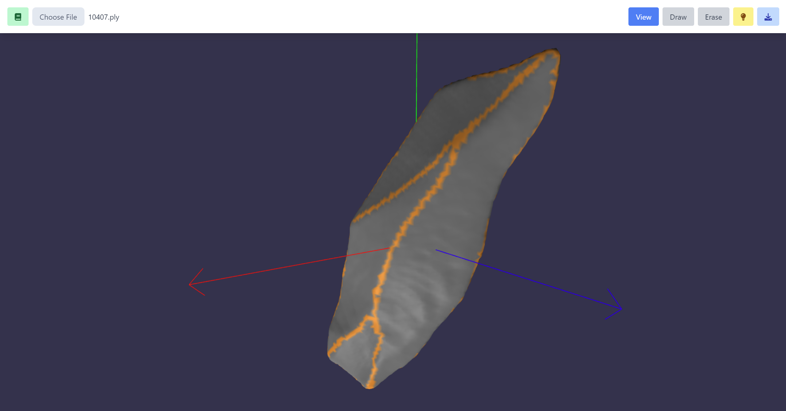

# lithicmesh

## 3D mesh annotation tool for lithic artifacts

The web page is deployed [here](https://fanciful-treacle-652e25.netlify.app/).

## TODO list

- [ ] Support exported files with annotations
- [ ] Automated edge identification algorithms
- [ ] Segmentation: algorithm and visualization mode
- [ ] Annotation with arrows
- [ ] [Bounding Volume Hierarchy](https://github.com/gkjohnson/three-mesh-bvh) for drawing on large objects